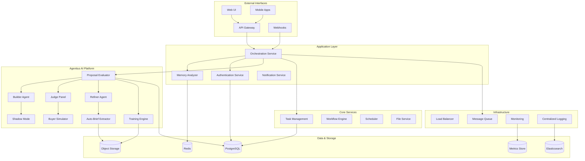
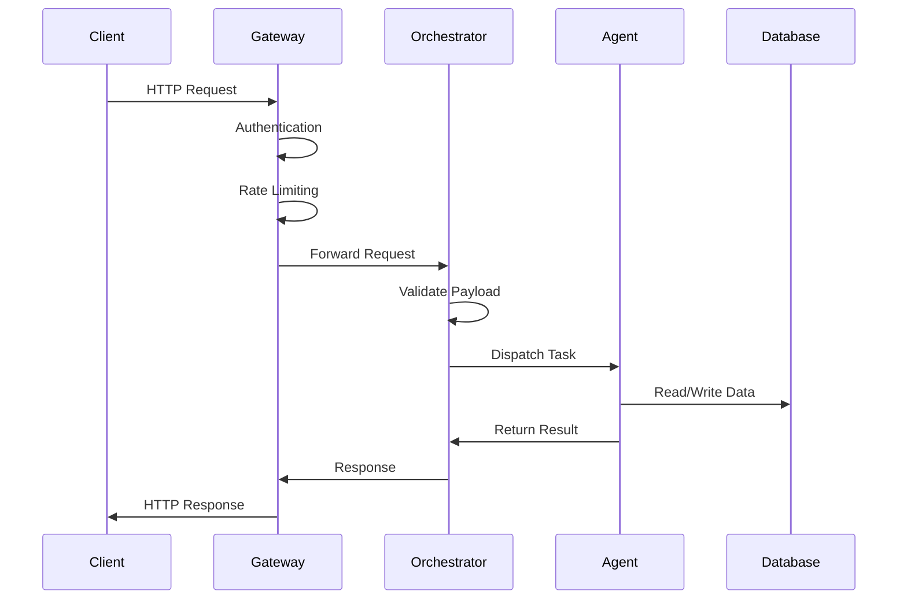
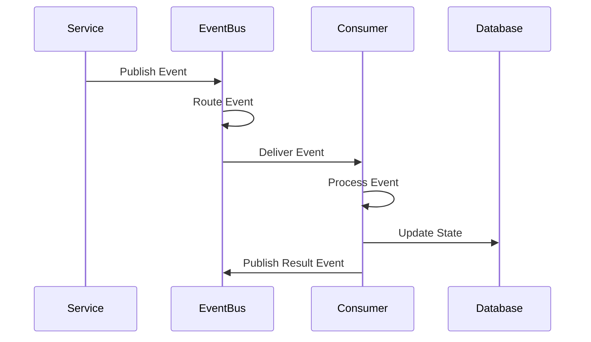
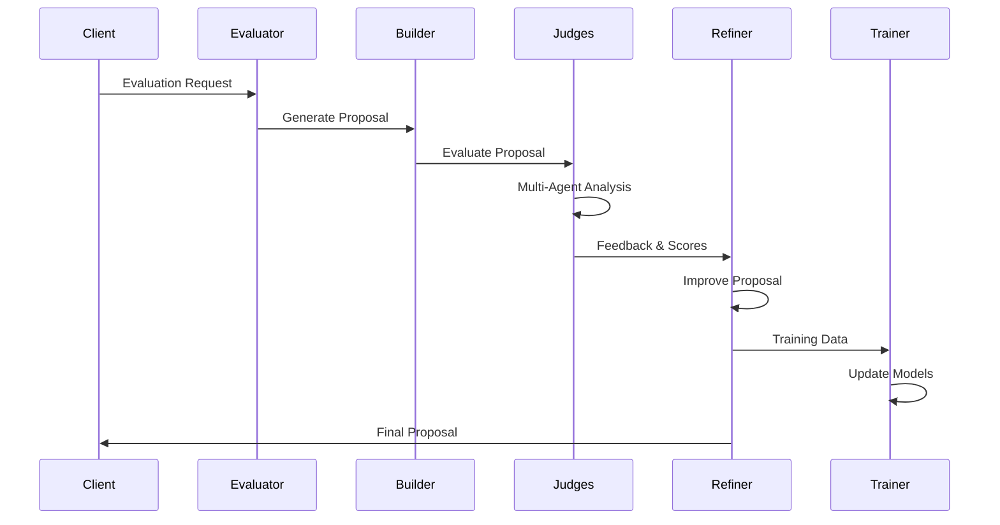
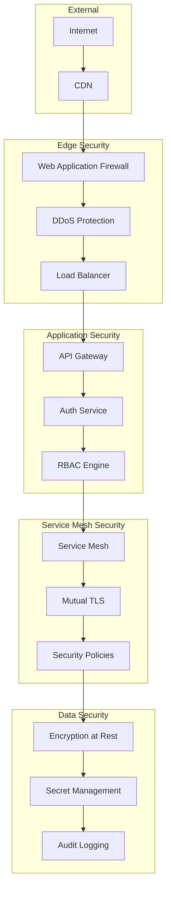
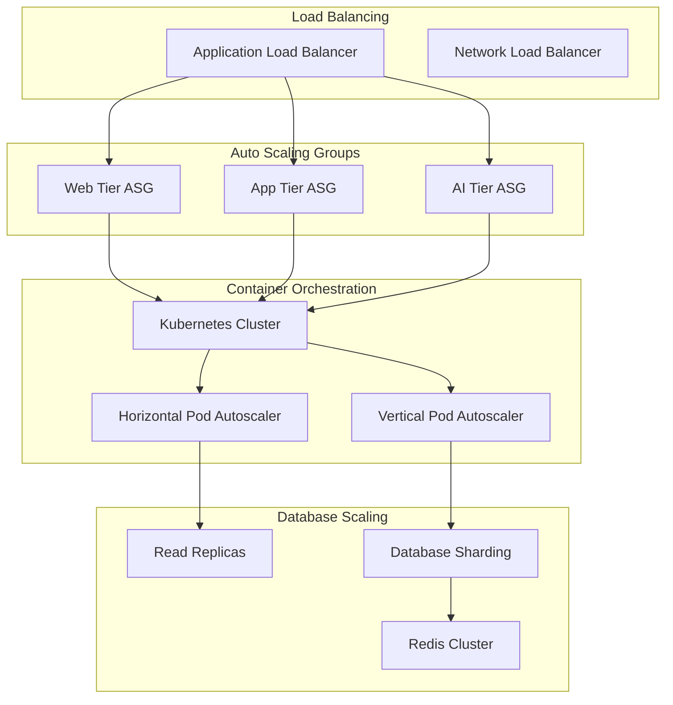
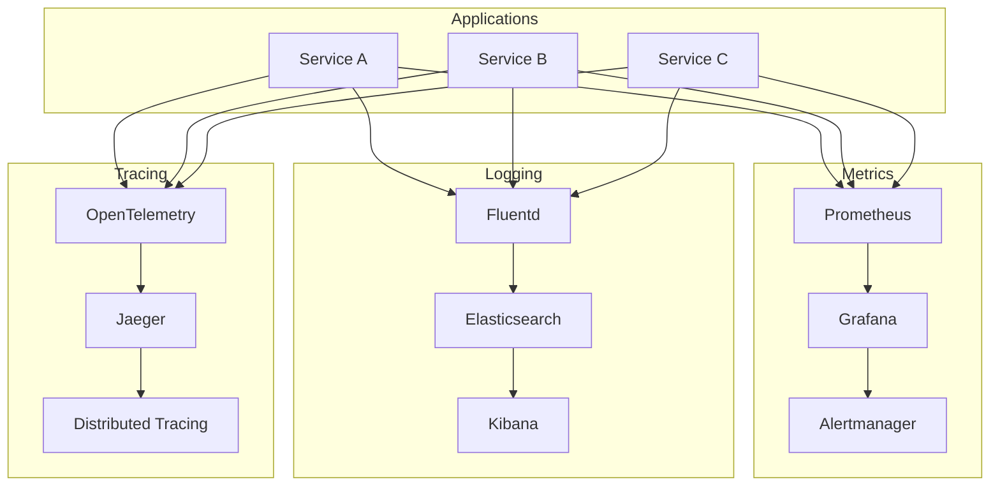
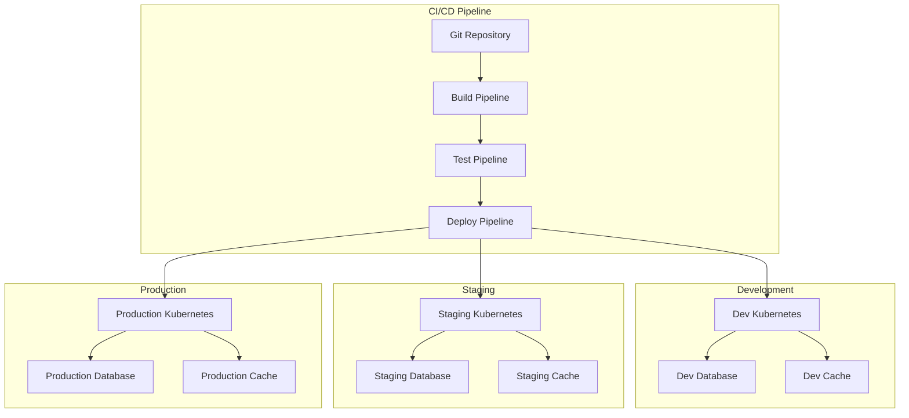

# SuperMCP System Architecture Overview

## 🏗️ **Enterprise Architecture**

SuperMCP follows a modern microservices architecture designed for enterprise scalability, reliability, and maintainability. The system is built on event-driven principles with autonomous AI agents and comprehensive observability.

---

## 🎯 **Design Principles**

### **1. Microservices First**
- **Independent Deployment** - Each service can be deployed separately
- **Technology Diversity** - Services can use different tech stacks
- **Fault Isolation** - Failures in one service don't cascade
- **Team Autonomy** - Teams can work independently on services

### **2. Event-Driven Architecture**
- **Loose Coupling** - Services communicate via events
- **Asynchronous Processing** - Non-blocking operations
- **Event Sourcing** - Complete audit trail of all changes
- **Reactive Systems** - Responsive, resilient, elastic

### **3. AI-Native Design**
- **Multi-Agent Systems** - Specialized AI agents for different tasks
- **Continuous Learning** - Systems improve automatically
- **Psychological Modeling** - Human-like decision processes
- **Transparent AI** - Complete explainability of AI decisions

### **4. Enterprise Grade**
- **Security First** - Zero-trust security model
- **Compliance Ready** - GDPR, HIPAA, SOC 2 compliance
- **High Availability** - 99.99% uptime design
- **Observability** - Comprehensive monitoring and tracing

---

## 🏢 **System Architecture**

---

## 📊 **Service Architecture**

### **Frontend Tier**
| Component | Technology | Purpose |
|-----------|------------|---------|
| Web UI | React/TypeScript | Main user interface |
| Mobile Apps | React Native | Mobile experience |
| API Gateway | Kong/Envoy | API routing and security |
| CDN | CloudFlare | Static asset delivery |

### **Application Tier**
| Service | Technology | Purpose |
|---------|------------|---------|
| Orchestration | Python/FastAPI | Main coordination service |
| Memory Analyzer | Python | Context and memory management |
| Authentication | Python/FastAPI | Identity and access management |
| Notification | Node.js | Real-time notifications |

### **AI Platform Tier**
| Service | Technology | Purpose |
|---------|------------|---------|
| Proposal Evaluator | Python | Main Agentius service |
| Builder Agent | Python/LangChain | Proposal generation |
| Judge Agents | Python/LangChain | Multi-perspective evaluation |
| Refiner Agent | Python/LangChain | Iterative improvement |
| Training Engine | Python/PyTorch | Continuous learning |

### **Data Tier**
| Component | Technology | Purpose |
|-----------|------------|---------|
| PostgreSQL | PostgreSQL 15 | Primary database |
| Redis | Redis 7 | Caching and sessions |
| Object Storage | S3/MinIO | File and media storage |
| Elasticsearch | Elasticsearch 8 | Search and analytics |
| ClickHouse | ClickHouse | Metrics and events |

---

## 🔄 **Data Flow Architecture**

### **Request Processing Flow**

### **Event Processing Flow**

### **AI Pipeline Flow**

---

## 🔐 **Security Architecture**

### **Zero-Trust Security Model**

### **Security Layers**

#### **1. Network Security**
- **WAF Protection** - OWASP Top 10 protection
- **DDoS Mitigation** - Automatic threat detection
- **VPC Isolation** - Network segmentation
- **Zero-Trust Networking** - No implicit trust

#### **2. Application Security**
- **JWT Authentication** - Stateless authentication
- **RBAC Authorization** - Fine-grained permissions
- **Input Validation** - Comprehensive sanitization
- **CORS Protection** - Cross-origin security

#### **3. Data Security**
- **Encryption at Rest** - AES-256 encryption
- **Encryption in Transit** - TLS 1.3
- **Key Management** - HashiCorp Vault
- **PII Protection** - Automatic anonymization

#### **4. Infrastructure Security**
- **Container Security** - Image scanning
- **Secret Management** - No hardcoded secrets
- **Audit Logging** - Complete activity tracking
- **Compliance Monitoring** - Continuous compliance

---

## 📈 **Scalability Architecture**

### **Horizontal Scaling**

### **Scaling Strategies**

#### **1. Application Scaling**
- **Horizontal Pod Autoscaling** - Based on CPU/memory/custom metrics
- **Vertical Pod Autoscaling** - Right-sizing containers
- **Cluster Autoscaling** - Adding/removing nodes
- **Multi-AZ Deployment** - High availability

#### **2. Database Scaling**
- **Read Replicas** - Distribute read load
- **Connection Pooling** - Efficient connection management
- **Query Optimization** - Performance tuning
- **Caching Strategy** - Multi-level caching

#### **3. AI Scaling**
- **Model Serving** - Distributed inference
- **Batch Processing** - Efficient training
- **GPU Acceleration** - High-performance computing
- **Edge Deployment** - Latency optimization

---

## 🔍 **Observability Architecture**

### **Three Pillars of Observability**

### **Monitoring Strategy**

#### **1. Application Metrics**
- **Business Metrics** - KPIs and business outcomes
- **Performance Metrics** - Latency, throughput, errors
- **Infrastructure Metrics** - CPU, memory, disk, network
- **Custom Metrics** - Domain-specific measurements

#### **2. Logging Strategy**
- **Structured Logging** - JSON format with consistent fields
- **Log Levels** - Debug, info, warn, error, fatal
- **Correlation IDs** - Request tracing across services
- **Log Aggregation** - Centralized log collection

#### **3. Distributed Tracing**
- **Request Tracing** - End-to-end request flow
- **Performance Analysis** - Bottleneck identification
- **Error Tracking** - Exception propagation
- **Dependency Mapping** - Service relationship visualization

---

## 🚀 **Deployment Architecture**

### **Multi-Environment Strategy**

### **Deployment Strategies**

#### **1. Blue-Green Deployment**
- **Zero Downtime** - Seamless service updates
- **Quick Rollback** - Instant rollback capability
- **Traffic Switching** - Gradual traffic migration
- **Health Checking** - Automated health validation

#### **2. Canary Deployment**
- **Progressive Rollout** - Gradual feature rollout
- **Risk Mitigation** - Limited blast radius
- **A/B Testing** - Feature effectiveness testing
- **Automated Rollback** - Failure detection and rollback

#### **3. Infrastructure as Code**
- **Terraform** - Infrastructure provisioning
- **Helm Charts** - Kubernetes deployments
- **GitOps** - Configuration management
- **Environment Parity** - Consistent environments

---

## 🎯 **Performance Architecture**

### **Performance Optimization Strategies**

#### **1. Application Performance**
- **Async Processing** - Non-blocking operations
- **Connection Pooling** - Efficient resource usage
- **Caching Layers** - Multi-level caching
- **Code Optimization** - Performance-first development

#### **2. Database Performance**
- **Query Optimization** - Efficient query execution
- **Index Strategy** - Optimal indexing
- **Partitioning** - Data distribution
- **Connection Management** - Pool optimization

#### **3. Network Performance**
- **CDN Usage** - Global content delivery
- **Compression** - Data transfer optimization
- **Keep-Alive** - Connection reuse
- **Load Balancing** - Traffic distribution

#### **4. AI Performance**
- **Model Optimization** - Efficient inference
- **Batch Processing** - Throughput optimization
- **GPU Utilization** - Hardware acceleration
- **Model Caching** - Inference acceleration

---

## 📋 **Architecture Decision Records (ADRs)**

### **ADR-001: Microservices Architecture**
- **Status:** Accepted
- **Decision:** Use microservices over monolithic architecture
- **Rationale:** Better scalability, team autonomy, technology diversity

### **ADR-002: Event-Driven Communication**
- **Status:** Accepted  
- **Decision:** Use events for service communication
- **Rationale:** Loose coupling, resilience, audit trail

### **ADR-003: Kubernetes Orchestration**
- **Status:** Accepted
- **Decision:** Use Kubernetes for container orchestration
- **Rationale:** Industry standard, auto-scaling, cloud portability

### **ADR-004: PostgreSQL as Primary Database**
- **Status:** Accepted
- **Decision:** Use PostgreSQL for primary data storage
- **Rationale:** ACID compliance, JSON support, mature ecosystem

### **ADR-005: Redis for Caching**
- **Status:** Accepted
- **Decision:** Use Redis for caching and sessions
- **Rationale:** High performance, data structures, persistence

---

## 🔄 **Evolution Strategy**

### **Current State (v2.0)**
- Microservices architecture
- Basic AI capabilities
- Manual deployment
- Single cloud provider

### **Next Phase (v2.5)**
- Advanced AI features
- Multi-cloud deployment
- Automated scaling
- Enhanced security

### **Future Vision (v3.0)**
- Autonomous operations
- Global deployment
- Edge computing
- Quantum-ready

---

**📚 For detailed implementation guides, see the [Services Documentation](../services/) and [Deployment Guides](../deployment/).**